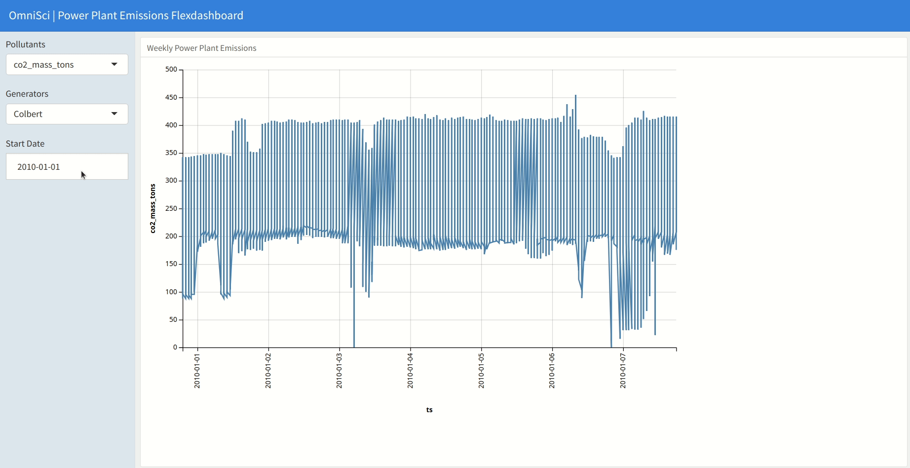

# EARL2018

Materials from the talk 'GPU-Accelerated visualisation: A primer on exploratory data analysis at scale' by Randy Zwitch at EARL 2018 Boston.

## Data

The data are ~720MM records representing hourly pollution measurements for power generators in the United States from the [EPA Air Markets Program](https://ampd.epa.gov/ampd/). The data can be retrieved from their public FTP: [ftp://newftp.epa.gov/DMDnLoad](ftp://newftp.epa.gov/DMDnLoad)

## Summary

This talk demonstrated the current state of R support for working with OmniSci (formerly, MapD):

- ODBC and reticulate were used to show how to access OmniSci
- Using dplyr to work with large volumes of data with sub-second speed
- Creating a flexdashboard as a view against the entire 720MM dataset
